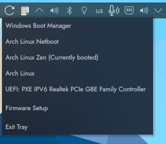

# UEFI Reboot Picker

The "I'm too cool to use a boot loader" edition of [grub-reboot-picker](https://github.com/mendhak/grub-reboot-picker) using `efibootmgr` instead of Grub. 

This utility is an app indicator (tray icon) to help you reboot into other OSes, or UEFI/BIOS, or the same OS.  
Instead of picking the OS you want during reboot at the UEFI firmware menu, you can just preselect it from the menu here.  
Basically it's a wrapper around `efibootmgr`. Tested under Arch Linux. 

 

## Installing vs just executing the script

You can either install the application or just run the python script (./src/uefi-reboot-picker.py). By using the install script the application gets put into autostart and the included polkit policy allows setting the reboot targets without asking for root privileges. 

* Clone the repo
  ```
  git clone https://github.com/DerBrotbaum/uefi-reboot-picker
  ```
* Run the install script (as root)
  ```
  ./uefi-reboot-picker/install.sh
  ```

## Run it

The application will auto start the next time you log in.  
You can also launch it directly by searching for `UEFI Reboot Picker` in Activities


## Use it

Click on the application icon.  
A menu with UEFI boot entries will appear.  
Click one of the entries.  
After a moment, the system will reboot into the selected entry.


# Developing locally

## Running it from this repo

You can run this application directly from this git repo.  

First get the dependencies

```
sudo apt install python3-gi python3-gi-cairo gir1.2-gtk-3.0 gir1.2-appindicator3-0.1

```

Clone this repo, then run the python script. 

```
cd src
sudo ./grub-reboot-picker.py
```

## Application structure

There's a lot happening in a .deb file.  For my own benefit, here are the files it creates, and their purpose. 


### .desktop file

The `com.mendhak.grubrebootpicker.desktop` file goes in two places. 

`/etc/xdg/autostart/` -  ensures that the app is launched when the user logs in  
`/usr/share/applications/` - ensures that the app can be found when searching through Activities. 

### .policy file

The `com.mendhak.grubrebootpicker.policy` is a [polkit policy file](https://wiki.archlinux.org/index.php/Polkit) goes in `/usr/share/polkit-1/actions/`.  
This in turn allows the application to run `efibootmgr` without a password prompt.  

### The script

As part of the build the `.py` extension is removed.  During install, the executable, extensionless Python script is put in `/bin` so that it's on the user's $PATH.  
